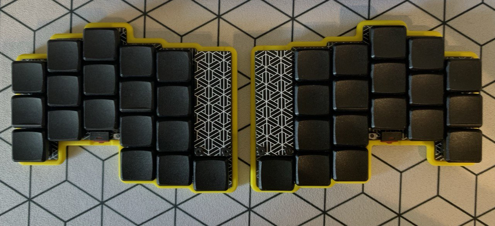
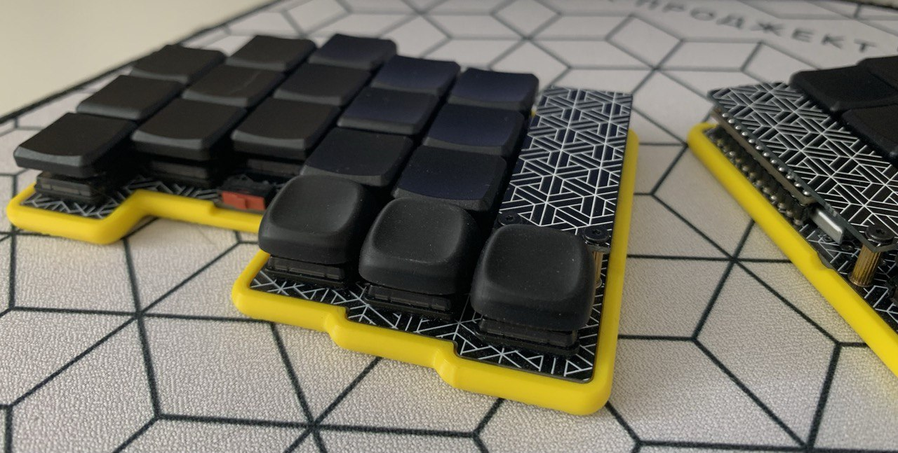

```
 _____ _____ _____     _____ _____ _____ _____ _____ _____
|__   |     |  |  |___|     |     |   | |   __|     |   __|
|   __| | | |    -|___|   --|  |  | | | |   __|-   -|  |  |
|_____|_|_|_|__|__|   |_____|_____|_|___|__|  |_____|_____|

```

# ZMK firmware for gbEnki Keyboard

This is a ZMK configuration for the gbEnki keyboard.

This branch for keyboard with LEDs. For keyboard without LEDs use [another branch](https://github.com/aroum/zmk-gbEnki/tree/withoutLED). The bootloader and compiled firmware can be downloaded in the [releases section](https://github.com/aroum/zmk-gbEnki/releases). You can change keymap using [this tool](https://nickcoutsos.github.io/keymap-editor/).

Link to project: [https://github.com/aroum/zmk-gbEnki/](https://github.com/aroum/zmk-gbEnki/)

## Photo



---


